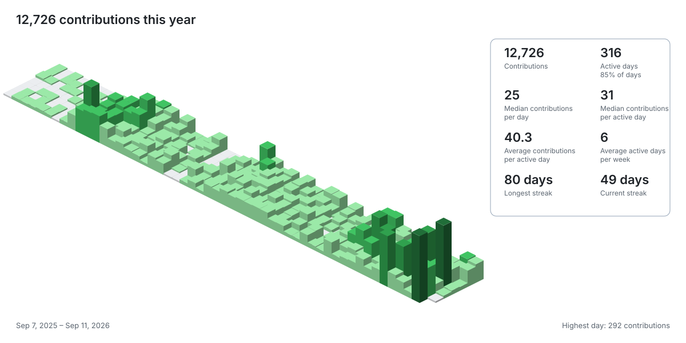

# GitHub Summary ✨

Turn a GitHub contribution graph into a tiny isometric city: every day is a cube, busy days grow taller, and the whole thing arrives as an SVG that GitHub can display in a README.



This repository is a Cloudflare Worker built with [Hono](https://hono.dev/). It is designed to be a template you can deploy under your own Cloudflare account and domain.

## The original spark

The visual idea comes from Jason Long’s original [isometric-contributions GitHub Chrome extension](https://github.com/jasonlong/isometric-contributions). That project runs inside the GitHub profile page and swaps the normal contribution grid for an Obelisk.js canvas. This project is a separate, server-rendered version for README embeds: it borrows the isometric spirit, but emits a self-contained SVG from a Worker at the edge.

## How the whole thing works

1. A request arrives at `/profile/:handle`, or at a generated `/user/:hash/:secret` URL.
2. The Worker fetches the public GitHub profile page.
3. GitHub lazy-loads the contribution graph through an `include-fragment`. The Worker discovers that fragment URL instead of hard-coding a calendar endpoint.
4. It requests the fragment with `X-Requested-With: XMLHttpRequest`, which returns the contribution table.
5. The parser reads each day’s `data-date`, week index, intensity level, and accessible tooltip. The tooltip supplies the exact contribution count, including zero days.
6. Statistics are calculated from those days: total, weekly total, best day, median contributions per day, active-day average, active days per week, activity percentage, and streaks with date ranges.
7. The renderer draws three SVG faces per day—top, left, and right—with height proportional to the count. No browser, canvas, native image library, or GitHub token is required.
8. Production responses are cached for 24 hours. Add any query parameter such as `?v=2026-09-11` to create a new cache key and force a fresh upstream read.

The `/demo` route follows the exact same parser and renderer, but reads the frozen `iplanwebsites` response bundled in [`test/fixtures`](test/fixtures) so it is deterministic and never contacts GitHub.

## Run it locally

```sh
npm install
npm run dev
```

Useful local URLs:

```text
http://localhost:8787/demo
http://localhost:8787/demo?theme=dark
http://localhost:8787/profile/octocat
http://localhost:8787/profile/octocat?theme=dark&v=refresh
```

Development uses `ENVIRONMENT=development`, refetches remote data on every image request, and sends `Cache-Control: no-store`.

## Deploy your own version

Please deploy your own Worker, KV namespace, and hostname rather than relying on the hosted demo. The production configuration in [`wrangler.jsonc`](wrangler.jsonc) is intentionally easy to adapt:

```sh
npm install
npx wrangler login
npx wrangler kv namespace create USERS --env production
npm run deploy
```

Before deploying, replace the production KV namespace ID and `github-summary.cookskill.dev` custom-domain route in `wrangler.jsonc` with resources from your own Cloudflare account. You can also remove the custom-domain route and use your own `workers.dev` hostname. The custom-domain configuration follows Cloudflare’s [Workers Custom Domains](https://developers.cloudflare.com/workers/configuration/routing/custom-domains/) model, and the username lookup uses a [Workers KV binding](https://developers.cloudflare.com/kv/concepts/kv-bindings/).

After deployment, your own README embed can be as simple as:

```md

```

The hosted demonstration is available at [github-summary.cookskill.dev](https://github-summary.cookskill.dev), but it is not a dependency of this repository.

## Routes

- `GET /demo` and `GET /demo.svg` render the frozen local fixture.
- `GET /profile/:handle` renders a live public profile directly.
- `GET /profile/handle/:handle` is an explicit alias for the same live route.
- `GET /user/:hash/:secret` renders a generated capability URL.
- `POST /api/users` with `{"username":"octocat"}` verifies the public profile and creates a shareable URL.
- `GET /` provides the small URL-creation homepage.
- `GET /health` returns a health response.
- `?theme=dark` selects the dark palette; any `?v=...` value busts the current cache key.

The generated URL stores a SHA-256 username hash and a random secret in its path. Workers KV maps that capability back to the username. The URL is shareable, and the random segment is an access link—not a GitHub credential.

## Testing and fixtures

```sh
npm test
npm run typecheck
```

The parser tests use frozen public responses in [`test/fixtures/iplanwebsites-profile.html`](test/fixtures/iplanwebsites-profile.html) and [`test/fixtures/iplanwebsites-contributions.html`](test/fixtures/iplanwebsites-contributions.html). This gives us a realistic regression feed without making tests dependent on GitHub availability or changing contribution counts.

## Privacy, security, and attribution

This Worker only reads unauthenticated public GitHub profile data. It does not log in to GitHub and does not contain a GitHub API token. The generated URL is a capability link, so treat it like any other shareable image URL.

The repository was checked for credential-shaped values, private-key blocks, environment files, and credential files in both the Worker history and the nested reference checkout. No such secrets are committed. The fixture files contain public GitHub HTML used for deterministic tests; GitHub’s public UI signatures and markup are not authentication credentials.

The upstream extension copy under [`reference/isometric-contributions`](reference/isometric-contributions) retains its original MIT license in [`LICENSE`](reference/isometric-contributions/LICENSE). This Worker is an independent implementation inspired by that project.
